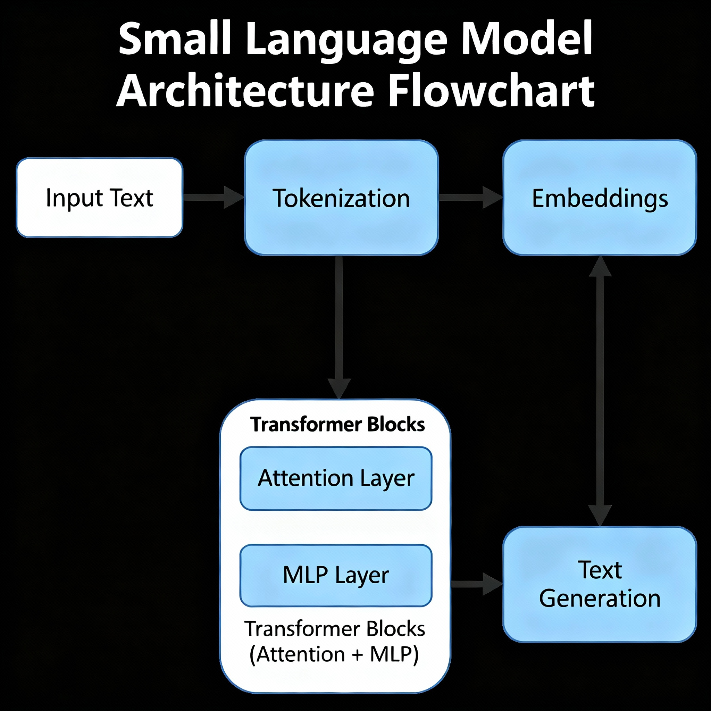

# StoryLLM: A Small Language Model for Creative Text Generation

A complete implementation of a Small Language Model (SLM) built from scratch with approximately 50-60 million parameters, designed to generate creative and coherent stories using child-friendly vocabulary.

## Overview

This project implements a GPT-style transformer architecture trained on the TinyStories dataset to create a language model capable of generating simple, coherent stories that use vocabulary typically understood by 3-4 year olds.

### Architecture Flow



---
## Architecture

The model follows a transformer-based architecture with the following key components:

### Model Configuration
- **Vocabulary Size**: 50,257 tokens (GPT-2 tokenizer)
- **Context Window**: 128 tokens
- **Layers**: 6 transformer blocks
- **Attention Heads**: 6 heads per layer
- **Embedding Dimension**: 384
- **Parameters**: ~50-60 million
- **Dropout**: 0.1

### Core Components

#### 1. **Token and Position Embeddings**
- Word token embeddings (`wte`): Maps tokens to 384-dimensional vectors
- Positional embeddings (`wpe`): Encodes position information up to 128 tokens
- Weight tying between input embeddings and output projection

#### 2. **Transformer Blocks**
Each of the 6 transformer blocks contains:
- **Multi-Head Causal Self-Attention**: 6 attention heads with causal masking
- **Feed-Forward Network**: 4× expansion (384 → 1536 → 384) with GELU activation
- **Layer Normalization**: Applied before attention and feed-forward layers (pre-norm)
- **Residual Connections**: Skip connections around attention and MLP layers

#### 3. **Attention Mechanism**
- **Flash Attention**: Uses optimized scaled dot-product attention when available
- **Causal Masking**: Prevents attending to future tokens
- **Dropout**: Applied to attention weights and residual connections

## Dataset

**TinyStories Dataset**: A synthetic dataset of short stories containing only vocabulary that 3-4 year olds typically understand, generated by GPT-3.5 and GPT-4.

- **Training Examples**: 2,119,719 stories
- **Validation Examples**: 21,990 stories
- **Tokenization**: GPT-2 BPE tokenizer
- **Storage**: Efficient binary format (.bin files) using memory-mapped arrays

## Training Configuration

### Hyperparameters
- **Learning Rate**: 1e-4 (initial)
- **Batch Size**: 32 
- **Gradient Accumulation**: 32 steps
- **Context Length**: 128 tokens
- **Training Steps**: 20,000 iterations
- **Evaluation Interval**: Every 500 steps

### Optimization
- **Optimizer**: AdamW with β₁=0.9, β₂=0.95
- **Weight Decay**: 0.1 for regularization
- **Learning Rate Schedule**: 
  - Linear warmup for 1,000 steps
  - Cosine annealing decay to minimum LR of 5e-4
- **Gradient Clipping**: Maximum norm of 0.5
- **Mixed Precision**: FP16/BF16 training with gradient scaling

### Training Results
The model achieved consistent training progress with loss decreasing from ~9.4 to ~2.4 over 20,000 iterations:

- **Initial Loss**: ~9.44 (train), ~9.45 (validation)
- **Final Loss**: ~2.39 (train), ~2.39 (validation)
- **Training Time**: Approximately 2-3 hours on T4 GPU

## Implementation Details

### Data Processing Pipeline
1. **Tokenization**: Convert text to token IDs using GPT-2 tokenizer
2. **Memory Mapping**: Store tokenized data in binary format for efficient loading
3. **Batch Generation**: Dynamic batching with random sampling from dataset
4. **Input-Output Pairs**: Each sequence provides both input and shifted target tokens

### Model Architecture Code Structure
```python
class GPT(nn.Module):
    def __init__(self, config):
        self.transformer = nn.ModuleDict({
            'wte': nn.Embedding(vocab_size, n_embd),      # Token embeddings
            'wpe': nn.Embedding(block_size, n_embd),      # Position embeddings  
            'drop': nn.Dropout(dropout),                   # Embedding dropout
            'h': nn.ModuleList([Block(config) for _ in range(n_layer)]),  # Transformer blocks
            'ln_f': LayerNorm(n_embd, bias),              # Final layer norm
        })
        self.lm_head = nn.Linear(n_embd, vocab_size, bias=False)  # Output projection
```

### Key Features
- **Weight Tying**: Input embeddings and output projection share weights
- **Causal Attention**: Autoregressive generation with proper masking
- **Gradient Checkpointing**: Memory-efficient training for larger models
- **Mixed Precision**: Automatic mixed precision for faster training

## Usage

### Text Generation
The model supports controllable text generation with:
- **Temperature Sampling**: Control randomness (temperature=1.0 default)
- **Top-k Filtering**: Limit to top-k most likely tokens
- **Maximum Length**: Specify maximum tokens to generate

### Example Generation
```python
# Generate text from prompt
prompt = "Once upon a time there was a pumpkin."
generated = model.generate(
    context, 
    max_new_tokens=200, 
    temperature=1.0
)
```

**Sample Output**:
> "Once upon a time there was a pumpkin. It was very special. The pumpkin wanted to paint with its family. So one day, a family decided to make it you all the time. They worked hard to remove something. 2 laser soldiers traveled and drove it grow into the sky. laughed like the whole. The pumpkin stopped and smiled and felt happy for the tube..."

## Performance Characteristics

### Model Capabilities
- **Coherent Narratives**: Generates grammatically correct, story-like text
- **Simple Vocabulary**: Uses age-appropriate language for young children
- **Narrative Structure**: Maintains basic story elements (characters, actions, settings)
- **Creative Elements**: Introduces imaginative scenarios and descriptions

### Limitations
- **Context Length**: Limited to 128 tokens (~100-150 words)
- **Vocabulary Scope**: Restricted to simple, child-friendly words
- **Consistency**: May lose narrative thread in longer generations
- **Logic**: Limited understanding of real-world physics and causality

## Technical Requirements

### Dependencies
```
torch>=1.9.0
transformers
datasets
tiktoken
numpy
matplotlib
tqdm
```

### Hardware Requirements
- **Training**: GPU with 8GB+ VRAM (T4, RTX 3080, V100)
- **Inference**: CPU or GPU with 2GB+ memory
- **Storage**: ~5GB for dataset and model checkpoints

## File Structure
```
├── StoryLLM.ipynb          # Complete implementation notebook
├── train.bin               # Tokenized training data  
├── validation.bin          # Tokenized validation data
├── best_model_params.pt    # Saved model checkpoint
└── README.md              # This documentation
```

## Key Innovations

1. **Efficient Data Loading**: Memory-mapped binary files for fast I/O
2. **Mixed Precision Training**: FP16/BF16 for 2x speed improvement  
3. **Gradient Accumulation**: Effective large batch training on limited GPU memory
4. **Weight Tying**: Reduces parameters while maintaining performance
5. **Optimized Attention**: Flash attention for improved memory efficiency

## Future Improvements

- **Larger Context**: Extend to 512 or 1024 token context windows
- **Model Scaling**: Experiment with larger architectures (100M+ parameters)
- **Advanced Sampling**: Implement nucleus (top-p) sampling
- **Fine-tuning**: Adapt model for specific story genres or styles
- **Evaluation Metrics**: Add perplexity, BLEU, and human evaluation scores

## Acknowledgments

This implementation draws inspiration from:
- **nanoGPT** by Andrej Karpathy for clean transformer implementation
- **TinyStories** dataset by Microsoft Research  
- **GPT-2** architecture and tokenization approach
- **Flash Attention** for efficient attention computation

## License

This project is available under the MIT License. The TinyStories dataset follows its original licensing terms.